# Ring Artifact Reduction in Medical Imaging

## Overview
This repository contains the implementation of a project for reducing ring artifacts in medical images. The project includes steps to create a dataset with ring artifacts, develop and train a deep learning model for artifact reduction, and evaluate the results in both image and sinogram domains.

## Dataset Creation
1. **Sinogram Creation**: Convert DICOM images in the dataset to sinograms.
2. **Adding Noise**: Introduce noise to the sinograms to simulate ring artifacts.
3. **Back-Projection**: Perform back-projection on the noisy sinograms to create images with ring artifacts.
4. **Saving as H5 Files**: Save the resulting images and sinograms in H5 format.
5. **Uploading to Kaggle**: Upload the dataset to Kaggle for public access.

### Image Domain

  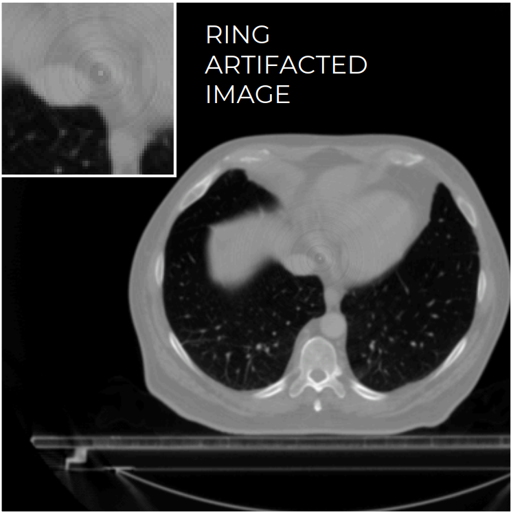
  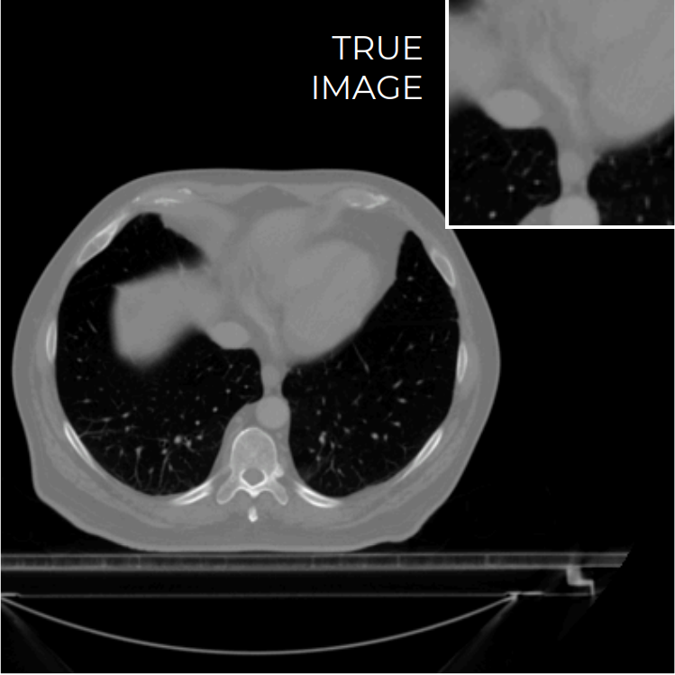 

### Sinogram Domain

     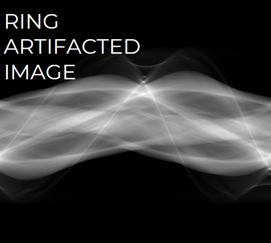
    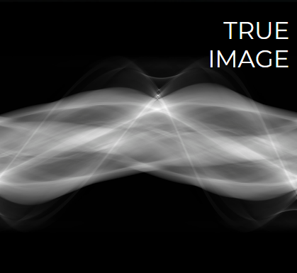

     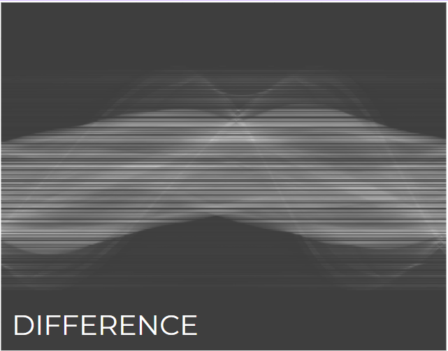
    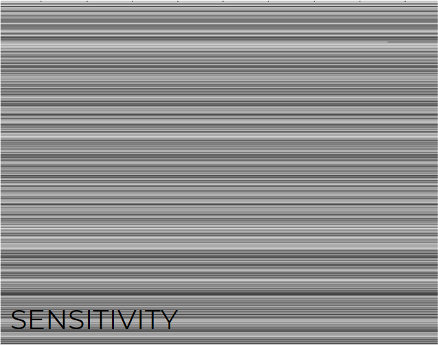

## Model Architecture

The model is designed to reduce ring artifacts in medical images and is based on a U-Net architecture.

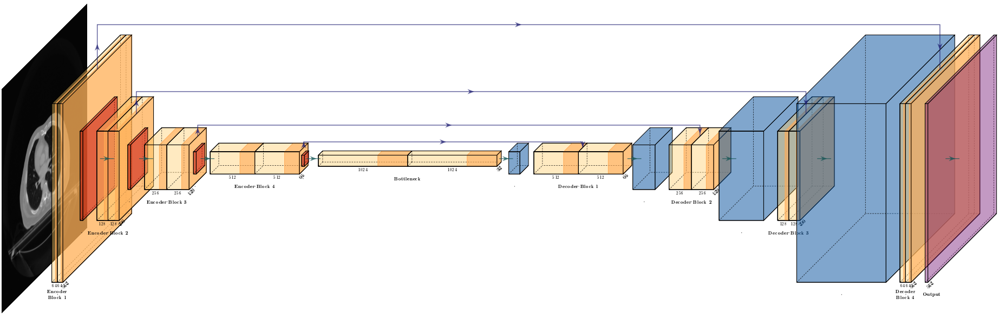

- **Input and Output Channels**: Configured for grayscale images with one input and one output channel. Adjustable for RGB or multi-class segmentation.
- **Encoder Blocks**: Four EncoderBlock modules, each with two convolutional layers, ReLU activations, increasing filters (64 to 512), and max pooling for downsampling.
- **Bottleneck**: Two convolutional layers with 1024 filters and ReLU activations for capturing abstract features.
- **Decoder Blocks**: Four DecoderBlock modules with up-convolutions to increase resolution, concatenating with encoder outputs, and decreasing filters (1024 to 64).
- **Final Layer**: A convolutional layer with a kernel size of 1 maps 64 feature channels to the output channels, typically followed by sigmoid or softmax activation.

## Model Training
- **Training Parameters**: 
  - Iterations over 100 epochs with early stopping after 2 consecutive epochs of no improvement in validation loss.
  - Model checkpoints are saved after each improvement in validation loss.
  - Training logs are recorded using TensorBoard SummaryWriter.
  - Training is performed on a GPU using PyTorch.
  - Both training and validation losses are tracked to evaluate performance and monitor convergence.

## Results
### Image Domain

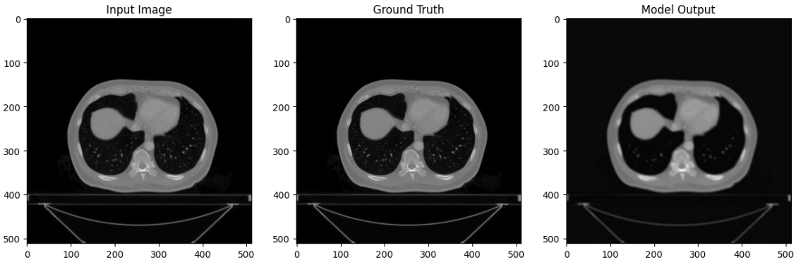

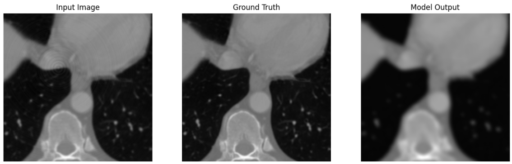

- **Artifact Reduction**: Reduction in ring artifacts results in some blurring and loss of features.
- **Speed**: Faster due to smaller data size.

### Sinogram Domain

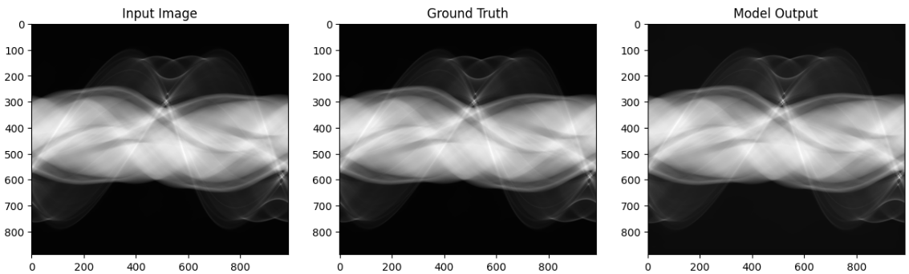

     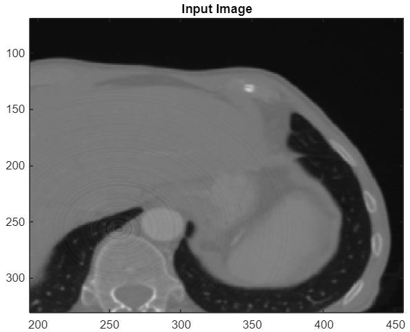
    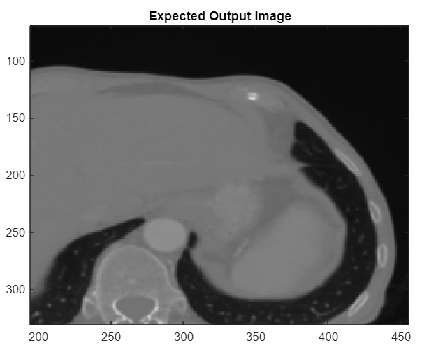
  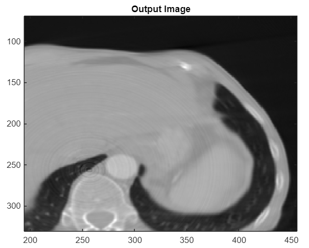

     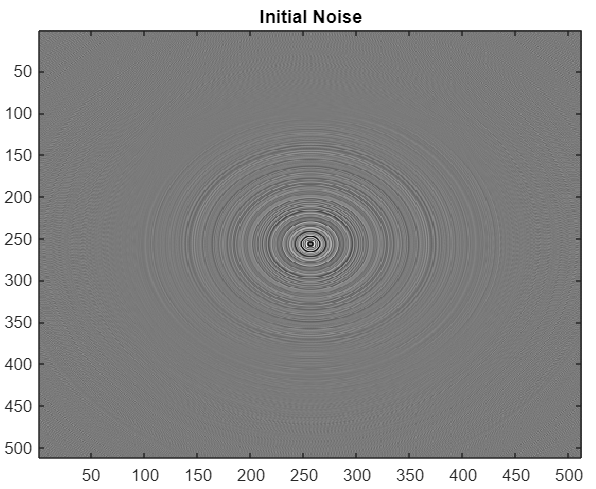
    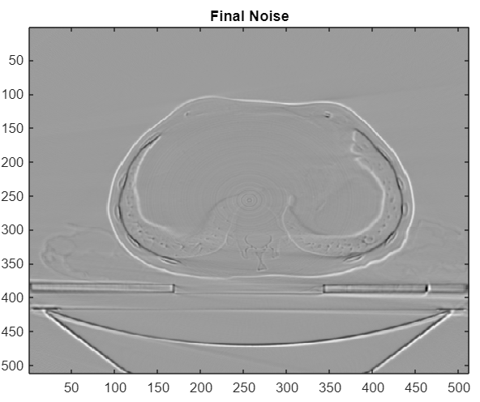

- **Artifact Reduction**: Better retention of image features with significant reduction in ring artifacts.
- **Data Size**: Larger data size increases computation time and storage requirements.

## Conclusion
- Ring artifact reduction in the sinogram domain preserves more image features compared to the image domain.
- The sinogram domain approach is slower due to larger data sizes but provides better artifact reduction.

## Authors
- Nakul C (122101024)
- Kevin R Jacob (122101018)

## License
This project is licensed under the MIT License. See the LICENSE file for details.
